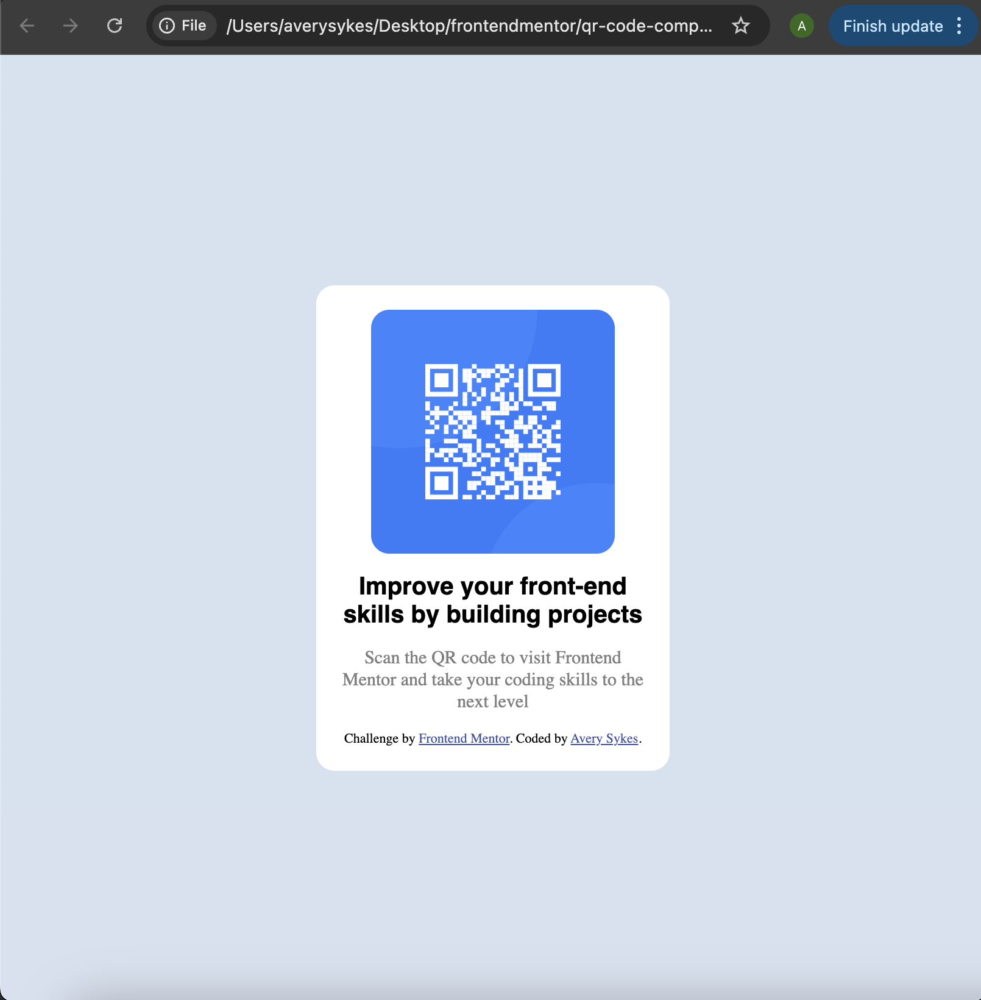

# Frontend Mentor - QR code component solution

This is a solution to the [QR code component challenge on Frontend Mentor](https://www.frontendmentor.io/challenges/qr-code-component-iux_sIO_H). Frontend Mentor challenges help you improve your coding skills by building realistic projects. 

## Table of contents

- [Overview](#overview)
  - [Screenshot](#screenshot)
  - [Links](#links)
- [My process](#my-process)
  - [Built with](#built-with)
  - [What I learned](#what-i-learned)
  - [Continued development](#continued-development)
  - [Useful resources](#useful-resources)
- [Author](#author)

**Note: Delete this note and update the table of contents based on what sections you keep.**

## Overview

### Screenshot

### Links

- Solution URL: (https://github.com/sweatylolz/qr-code)
- Live Site URL: (https://sweatylolz.github.io/qr-code/)

## My process

Step 1: I began by seperating the different pieces I wanted in different divs with class names. 
Step 2: I then used flexbox to get things in the places I wanted (based off the design photos provided).
Step 3: I added styles to everything to make it match the design.

### Built with

- Semantic HTML5 markup
- CSS custom properties
- Flexbox

### What I learned

The main thing I learned was how flexbox is applied to different containers. It helped me understand what css properties do what to what items. It also helped me reinforce using 'inspect' feature in my browser to see what was going on and tweak specific things.

### Continued development

I would like to utilize flexbox on something bigger with more elements. It is very useful and I want to fully understand how its potential

### Useful resources

google hehe

**Note: Delete this note and replace the list above with resources that helped you during the challenge. These could come in handy for anyone viewing your solution or for yourself when you look back on this project in the future.**

## Author

- Frontend Mentor - [@sweatylolz](https://www.frontendmentor.io/profile/sweatylolz)
